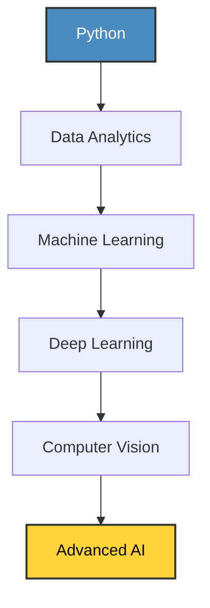

<h1 align="center">Hi 👋 I'm Muhammad Saad</h1>

Computer Engineering Undergraduate • AI & Computer Vision • Embedded Systems • Data Analytics

---

# 👨‍💻 Profile Snapshot

| 🎓 Education | 💼 Interests | 🎯 Career Goal |
|-------------|-------------|----------------|
| B.Sc. Computer Engineering | Computer Vision, AI, Embedded Systems, Data Analytics | AI & Computer Vision Engineer |

---

# 🧭 Engineering Roadmap

```mermaid
graph TD
    %% Root Node
    Root(Engineering) --> DA[Data Analytics]
    Root --> CV[Computer Vision]
    Root --> ES[Embedded Systems]

    %% Data Analytics Sub-nodes
    DA --> P1(Python)
    DA --> P2(Pandas)
    DA --> P3(NumPy)
    DA --> P4(Matplotlib)
    DA --> P5(Power BI)

    %% Computer Vision Sub-nodes
    CV --> C1(OpenCV)
    CV --> C2(Deep Learning)
    CV --> C3(AI Models)
    CV --> C4(Detection)
    CV --> C5(Recognition)

    %% Embedded Systems Sub-nodes
    ES --> E1(Raspberry Pi)
    ES --> E2(Arduino)
    ES --> E3(Buildroot)
    ES --> E4(Linux)
    ES --> E5(ECU)

    %% Styling
    style Root fill:#9c0511,stroke:#333,stroke-width:4px
    style DA fill:#024a17,stroke:#01579b
    style CV fill:#020966,stroke:#e65100
    style ES fill:#334502,stroke:#1b5e20
```

---

# ⚙ Tech Stack

| Programming | AI / Vision | Data | Embedded | Tools |
|-------------|-------------|------|----------|------|
| Python | OpenCV | Pandas | Raspberry Pi | Git |
| C++ | Computer Vision | NumPy | Arduino | GitHub |
| C | Image Processing | Matplotlib | Buildroot | VS Code |
| SQL | Deep Learning | Power BI | BusyBox | Linux |
| Verilog | | MySQL | Keil • Proteus | Jupyter |

---

# 📂 My Projects

| Project | Description | Tech |
|----------|-------------|------|
| 🐧 Embedded Linux ECU | Custom Linux using Buildroot & BusyBox | Raspberry Pi, Linux |
| 📊 Super Store Analytics | Data Cleaning, EDA & Visualization | MySQL, Python, Pandas |
| ✋ Hand Gesture Recognition | Real-time gesture recognition | OpenCV |
| 🏥 Hospital Management System | Desktop management software | Python |
| ☀ Smart Solar Bicycle | University Engineering Project | Hardware Integration |
| 🚦 Traffic Light Controller | Hardware implementation | Digital Logic |
| 📡 Laser Data Transmission | Arduino communication project | Embedded |

---

# 📚 Currently Learning

This roadmap visualizes my progression from foundational programming to advanced AI engineering.

## 🛠 Development Focus

  <table style="border-collapse: collapse; width: 100%; max-width: 700px;">
    <thead>
      <tr style="background-color: #1f2937;">
        <th style="padding: 12px; text-align: left; border: 1px solid #374151;">Domain</th>
        <th style="padding: 12px; text-align: center; border: 1px solid #374151;">Level</th>
      </tr>
    </thead>
    <tbody>
      <tr>
        <td style="padding: 12px; border: 1px solid #374151;"><strong>🐍 Python</strong></td>
        <td style="padding: 12px; text-align: center; border: 1px solid #374151; color: #22c55e;"><strong>Advance</strong></td>
      <tr>
        <td style="padding: 12px; border: 1px solid #374151;"><strong>📊 Data Analytics</strong></td>
        <td style="padding: 12px; text-align: center; border: 1px solid #374151; color: #eab308;"><strong>Advanced</strong></td>
      <tr>
        <td style="padding: 12px; border: 1px solid #374151;"><strong>👁️ Computer Vision</strong></td>
        <td style="padding: 12px; text-align: center; border: 1px solid #374151; color: #3b82f6;"><strong>Intermediate</strong></td>
      <tr>
        <td style="padding: 12px; border: 1px solid #374151;"><strong>🛠️ Embedded Linux</strong></td>
        <td style="padding: 12px; text-align: center; border: 1px solid #374151; color: #ec4899;"><strong>Intermediate</strong></td>
      <tr>
        <td style="padding: 12px; border: 1px solid #374151;"><strong>🧠 Deep Learning</strong></td>
        <td style="padding: 12px; text-align: center; border: 1px solid #374151; color: #8b5cf6;"><strong>Intermediate</strong></td>
    </tbody>
  </table>

# 📈 GitHub Statistics

# 🌐 Connect

⭐ Thanks for visiting my GitHub Profile ⭐

